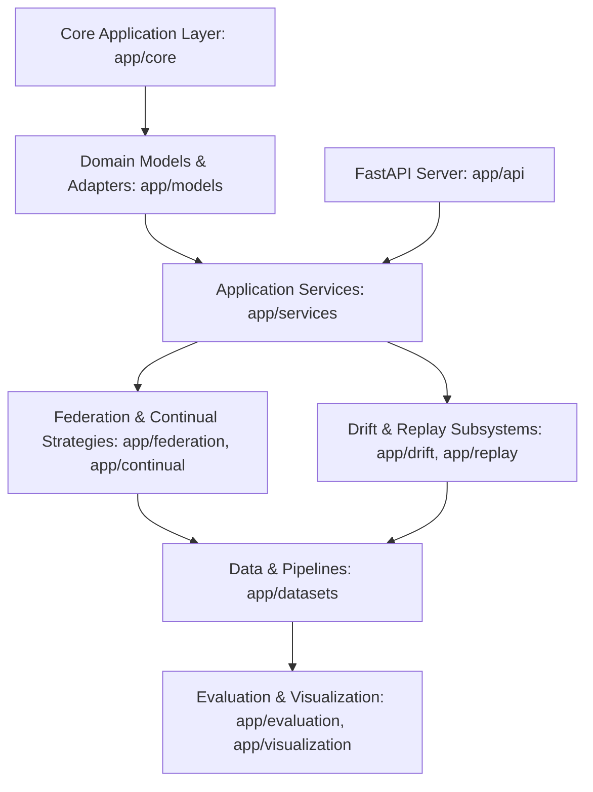

# DriftAdapt: Continual Federated LoRA Personalization of Foundation Models

[](#)
[](LICENSE)
[](#)

DriftAdapt is a research-grade software architecture designed for the continual, federated personalization of foundation models using Low-Rank Adaptation (LoRA). The system is custom-tailored for privacy-preserving health advisory systems deployed in low-resource edge environments.

---

## 1. Research Motivation & Project Overview

Edge-based health advisory applications face three concurrent challenges:
1. **Data Privacy**: Medical history is highly sensitive and cannot be centralized.
2. **Concept Drift**: Patient populations, diseases, and local contexts evolve continuously (covariate and concept drift).
3. **Resource Constraints**: Remote clinics and edge devices lack the computational capacity to train or store large-scale foundation models.

**DriftAdapt** solves this triple-constraint by pairing **Federated Learning** (ensuring local data privacy) with **LoRA Personalization** (keeping the resource footprint extremely low) and **Continual Learning** (incorporating online drift detection and synthetic feature replay to prevent catastrophic forgetting).

---

## 2. Primary Objectives

- **Privacy-Preserving Federated Architecture**: Decouple foundation model learning from raw data centralization.
- **Resource-Efficient Adaptation**: Apply PEFT (LoRA) to adapt models with fractionally small update footprints.
- **Continual Adaptation**: Maintain model accuracy under non-stationary distributions without forgetting prior historical facts.
- **Robust Verification**: Provide standardized experiment tracking, reproducibility seeds, and metric buses.

---

## 3. Architecture Overview

DriftAdapt uses **Clean Architecture** principles to separate core domain layers, application services, data access/management, and delivery mechanisms (API/CLI). The code is organized to prevent circular dependencies, expose clean dependency injection boundaries, and support modular extensions.



---

## 4. Repository Structure & Directory responsibilities

The structure below represents the foundation of DriftAdapt. Below is the purpose of each directory and how it integrates with future modules.

```
DriftAdapt/
│
├── app/                        # Main Python source package
│   ├── api/                    # REST API routes and schemas (Module 1.5/5)
│   ├── core/                   # Application configs, settings, lifecycles (Module 1.2/1.3)
│   ├── models/                 # Model loader & LoRA configuration definitions (Module 2/3)
│   ├── services/               # Orchestrated business logic services (Module 3/5/6)
│   ├── federation/             # Federated learning clients & weight aggregators (Module 5)
│   ├── continual/              # Continual learning strategies (Module 6/8)
│   ├── drift/                  # Distribution drift monitoring (Module 7)
│   ├── replay/                 # Synthetic feature replay buffers (Module 9)
│   ├── datasets/               # Preprocessing pipelines and client loaders (Module 4)
│   ├── evaluation/             # Model validation suites and client benchmarks (Module 10)
│   ├── visualization/          # Metrics plotting and dashboard renderers (Module 10)
│   ├── experiments/            # Orchestrator for hyperparameter runs (Module 10)
│   ├── metrics/                # Metrics Bus and event telemetry logs (Module 1.4)
│   ├── utils/                  # Reusable cross-cutting mathematical & path helpers
│   └── __init__.py
│
├── configs/                    # Global configurations (YAML) for models and clients (Module 1.2)
│
├── checkpoints/                # Caches for Hugging Face foundation models and LoRA adapters
│
├── datasets/                   # Local dataset directory structure (Module 4/9)
│   ├── raw/                    # Untouched external source datasets
│   ├── processed/              # Normalized, tokenized, or encoded feature datasets
│   ├── partitions/             # Non-IID client split allocations for federation
│   └── synthetic/              # Generated replay feature outputs
│
├── logs/                       # Running application and terminal output logs (Module 1.3)
│
├── experiments/                # Output artifacts from experimental trials (Module 10)
│   ├── configs/                # Serialized exact configurations of executed trials
│   ├── results/                # Raw trial data, accuracies, and metric outputs
│   ├── figures/                # Rendered loss curves, drift plots, and performance graphs
│   └── reports/                # Summary PDFs, logs, or markdown evaluation briefs
│
├── tests/                      # Automated test suite
│   ├── unit/                   # Isolated component and package tests
│   ├── integration/            # Multi-component collaboration and pipeline tests
│   └── system/                 # End-to-end flow and entrypoint boot tests
│
├── scripts/                    # Command-line utility scripts (e.g. bootstrap.py)
│
├── docs/                       # Design documents and markdown files
│
├── notebooks/                  # Jupyter notebooks for data analysis & research exploration
│
├── .github/
│   └── workflows/              # Continuous Integration action definition files
│
├── requirements/               # Modular dependency lists
│   ├── base.txt                # Production libraries (torch, transformers, etc.)
│   └── dev.txt                 # Quality & development utilities (black, pytest, etc.)
│
├── requirements.txt            # Redirect to base production dependencies
├── README.md                   # This project handbook
├── LICENSE                     # MIT License details
├── .gitignore                  # Git exclude criteria
├── .env.example                # Local environment template file
├── pyproject.toml              # Build backend and tool settings
└── main.py                     # Project verification entrypoint
```

### Detailed Directory Responsibilities

| Directory | Purpose | Future Module | Expected Files |
| :--- | :--- | :--- | :--- |
| **`app/api/`** | Exposes REST endpoints for edge nodes and aggregator | *Module 1.5 / 5* | Router, request/response models, middleware |
| **`app/core/`** | Coordinates application lifecycles and env settings | *Module 1.2 / 1.3* | Config schemas (`pydantic`), logging init |
| **`app/models/`** | Houses LLM wrappers and PEFT/LoRA adapter setup | *Module 2 / 3* | Base model class, AdapterConfig, quantization wrappers |
| **`app/services/`** | Coordinates high-level business functions | *Module 3 / 5 / 6* | InferenceService, LocalTrainingService, ReplayService |
| **`app/federation/`** | Controls client-side updates and server consolidation | *Module 5* | client.py, server.py, aggregation.py (FedAvg/FedProx) |
| **`app/continual/`** | Implements anti-forgetting optimization logic | *Module 6 / 8* | ewc.py, consolidation.py, scheduler.py |
| **`app/drift/`** | Implements online covariate/concept shift metrics | *Module 7* | detector.py (River wrappers), page_hinkley.py |
| **`app/replay/`** | Generates and manages historical feature vectors | *Module 9* | replay_buffer.py, generator.py |
| **`app/datasets/`** | Manages data tokenization and non-IID partitioning | *Module 4* | loader.py, partitioner.py, preprocess.py |
| **`app/evaluation/`** | Benchmarks accuracy, privacy leakage, resource metrics | *Module 10* | benchmark.py, evaluator.py, privacy_audit.py |
| **`app/visualization/`** | Plots charts, training logs, and drift detections | *Module 10* | loss_curves.py, drift_visualizer.py |
| **`app/experiments/`** | Automates parameter sweep execution | *Module 10* | manager.py, sweep.py |
| **`app/metrics/`** | Dispatches real-time events to collectors | *Module 1.4* | bus.py, events.py, schemas.py |
| **`configs/`** | YAML layouts mapping model sizes, client schedules | *Module 1.2* | default.yaml, client_config.yaml, server_config.yaml |
| **`checkpoints/`** | Local cache for base model and fine-tuned parameters | *Module 2 / 3* | `adapter_model.bin`, `adapter_config.json` |
| **`datasets/`** | Storage layer for data partitions and synthetic features | *Module 4 / 9* | CSV/Parquet records, patient data arrays |
| **`experiments/`** | Outputs structured reports and results from sweeps | *Module 10* | JSON records, PNG graphs, PDF briefs |

---

## 5. Environment Setup & Installation

### Prerequisite
Ensure you have **Python 3.10** or **Python 3.11** installed.

### Step 1: Clone the Repository
```bash
git clone <repository_url>
cd DriftAdapt
```

### Step 2: Establish the Virtual Environment
We recommend creating a Python virtual environment:

```powershell
# Windows PowerShell
python -m venv .venv
.\.venv\Scripts\Activate.ps1
```

```bash
# macOS/Linux Terminal
python3 -m venv .venv
source .venv/bin/activate
```

### Step 3: Install Dependencies
Install development dependencies to run unit tests and format checks:

```bash
pip install --upgrade pip
pip install -r requirements/dev.txt
```

---

## 6. Running the Project

### Idempotent Directory Bootstrapping
Before executing any ML tasks, configure the directory tree using the bootstrap script:

```bash
python scripts/bootstrap.py
```

### Run Verification Entrypoint
Validate that the Python package path resolves correctly and print the initialization message:

```bash
python main.py
```
Expected output:
```
Project initialized successfully.
```

---

## 7. Future Modules Roadmap

The DriftAdapt project is broken down into modular phases:
- **Module 1.1**: Architecture & Repository Foundation (Completed)
- **Module 1.2**: Configuration Management (YAML loaders & Pydantic validators)
- **Module 1.3**: Structured Logging (Loguru sinks and file rotators)
- **Module 1.4**: Metric Bus & Telemetry Pipeline
- **Module 1.5**: Device Manager & Local API Server
- **Module 2**: Foundation Model Integration & Quantization (Hugging Face / BitsAndBytes)
- **Module 3**: LoRA Personalization (PEFT adapters, local fine-tuning)
- **Module 4**: Healthcare Dataset Pipelines (Preprocessing, non-IID partitioning)
- **Module 5**: Federated Learning (FedAvg, FedProx, Weight Aggregation)
- **Module 6**: Continual Learning Strategies (EWC, memory consolidation)
- **Module 7**: Online Drift Detection (Concept/Covariate monitoring)
- **Module 8**: Adaptive Training Scheduling
- **Module 9**: Synthetic Feature Replay
- **Module 10**: Benchmarking, Plots, and Verification

---

## 8. Coding Standards & Contribution Guidelines

- **PEP8 Style Compliance**: Code formatting is enforced using `black` and `isort`.
- **Typing Guidelines**: All functions, methods, and classes must include static type signatures. Validate with `mypy`.
- **Quality Assurance**: Do not commit code that fails `flake8` checks.
- **Testing**: Place unit tests inside `tests/unit/` using the `pytest` structure.

---

## 9. License

This repository is licensed under the [MIT License](LICENSE).
