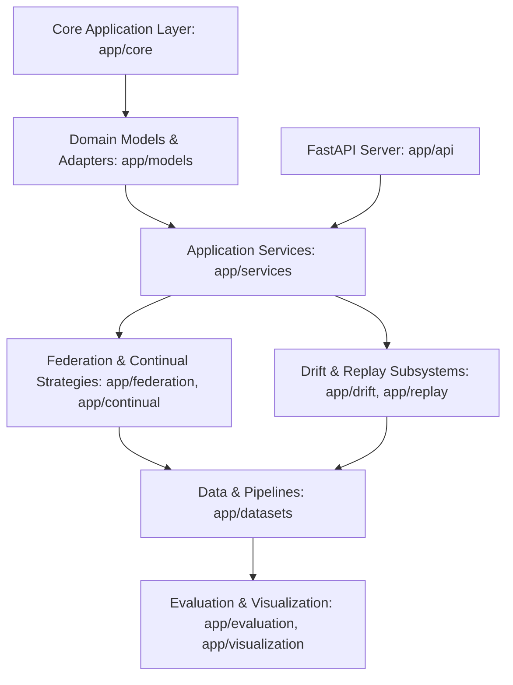
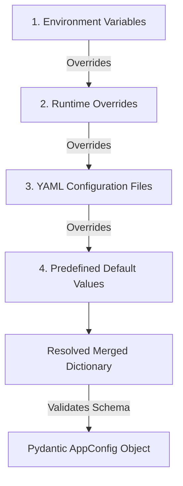
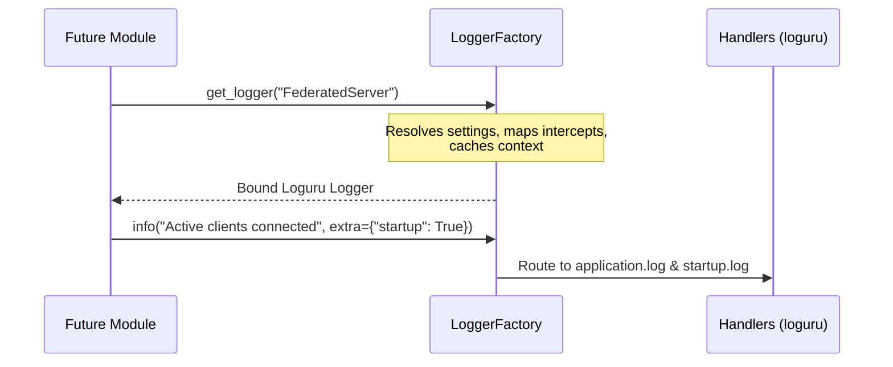

# DriftAdapt: Continual Federated LoRA Personalization of Foundation Models

[](#)
[](LICENSE)
[](#)

DriftAdapt is a research-grade software architecture designed for the continual, federated personalization of foundation models using Low-Rank Adaptation (LoRA). The system is custom-tailored for privacy-preserving health advisory systems deployed in low-resource edge environments.

---

## 1. Research Motivation & Project Overview

Edge-based health advisory applications face three concurrent challenges:
1. **Data Privacy**: Medical history is highly sensitive and cannot be centralized.
2. **Concept Drift**: Patient populations, diseases, and local contexts evolve continuously (covariate and concept drift).
3. **Resource Constraints**: Remote clinics and edge devices lack the computational capacity to train or store large-scale foundation models.

**DriftAdapt** solves this triple-constraint by pairing **Federated Learning** (ensuring local data privacy) with **LoRA Personalization** (keeping the resource footprint extremely low) and **Continual Learning** (incorporating online drift detection and synthetic feature replay to prevent catastrophic forgetting).

---

## 2. Primary Objectives

- **Privacy-Preserving Federated Architecture**: Decouple foundation model learning from raw data centralization.
- **Resource-Efficient Adaptation**: Apply PEFT (LoRA) to adapt models with fractionally small update footprints.
- **Continual Adaptation**: Maintain model accuracy under non-stationary distributions without forgetting prior historical facts.
- **Robust Verification**: Provide standardized experiment tracking, reproducibility seeds, and metric buses.

---

## 3. Architecture Overview

DriftAdapt uses **Clean Architecture** principles to separate core domain layers, application services, data access/management, and delivery mechanisms (API/CLI). The code is organized to prevent circular dependencies, expose clean dependency injection boundaries, and support modular extensions.



---

## 4. Repository Structure & Directory responsibilities

The structure below represents the foundation of DriftAdapt. Below is the purpose of each directory and how it integrates with future modules.

```
DriftAdapt/
│
├── app/                        # Main Python source package
│   ├── api/                    # REST API routes and schemas (Module 1.5/5)
│   ├── core/                   # Application configs, settings, lifecycles (Module 1.2/1.3)
│   ├── models/                 # Model loader & LoRA configuration definitions (Module 2/3)
│   ├── services/               # Orchestrated business logic services (Module 3/5/6)
│   ├── federation/             # Federated learning clients & weight aggregators (Module 5)
│   ├── continual/              # Continual learning strategies (Module 6/8)
│   ├── drift/                  # Distribution drift monitoring (Module 7)
│   ├── replay/                 # Synthetic feature replay buffers (Module 9)
│   ├── datasets/               # Preprocessing pipelines and client loaders (Module 4)
│   ├── evaluation/             # Model validation suites and client benchmarks (Module 10)
│   ├── visualization/          # Metrics plotting and dashboard renderers (Module 10)
│   ├── experiments/            # Orchestrator for hyperparameter runs (Module 10)
│   ├── metrics/                # Metrics Bus and event telemetry logs (Module 1.4)
│   ├── utils/                  # Reusable cross-cutting mathematical & path helpers
│   └── __init__.py
│
├── configs/                    # Global configurations (YAML) for models and clients (Module 1.2)
│
├── checkpoints/                # Caches for Hugging Face foundation models and LoRA adapters
│
├── datasets/                   # Local dataset directory structure (Module 4/9)
│   ├── raw/                    # Untouched external source datasets
│   ├── processed/              # Normalized, tokenized, or encoded feature datasets
│   ├── partitions/             # Non-IID client split allocations for federation
│   └── synthetic/              # Generated replay feature outputs
│
├── logs/                       # Running application and terminal output logs (Module 1.3)
│
├── experiments/                # Output artifacts from experimental trials (Module 10)
│   ├── configs/                # Serialized exact configurations of executed trials
│   ├── results/                # Raw trial data, accuracies, and metric outputs
│   ├── figures/                # Rendered loss curves, drift plots, and performance graphs
│   └── reports/                # Summary PDFs, logs, or markdown evaluation briefs
│
├── tests/                      # Automated test suite
│   ├── unit/                   # Isolated component and package tests
│   ├── integration/            # Multi-component collaboration and pipeline tests
│   └── system/                 # End-to-end flow and entrypoint boot tests
│
├── scripts/                    # Command-line utility scripts (e.g. bootstrap.py)
│
├── docs/                       # Design documents and markdown files
│
├── notebooks/                  # Jupyter notebooks for data analysis & research exploration
│
├── .github/
│   └── workflows/              # Continuous Integration action definition files
│
├── requirements/               # Modular dependency lists
│   ├── base.txt                # Production libraries (torch, transformers, etc.)
│   └── dev.txt                 # Quality & development utilities (black, pytest, etc.)
│
├── requirements.txt            # Redirect to base production dependencies
├── README.md                   # This project handbook
├── LICENSE                     # MIT License details
├── .gitignore                  # Git exclude criteria
├── .env.example                # Local environment template file
├── pyproject.toml              # Build backend and tool settings
└── main.py                     # Project verification entrypoint
```

### Detailed Directory Responsibilities

| Directory | Purpose | Future Module | Expected Files |
| :--- | :--- | :--- | :--- |
| **`app/api/`** | Exposes REST endpoints for edge nodes and aggregator | *Module 1.5 / 5* | Router, request/response models, middleware |
| **`app/core/`** | Coordinates application lifecycles and env settings | *Module 1.2 / 1.3* | Config schemas (`pydantic`), logging init |
| **`app/models/`** | Houses LLM wrappers and PEFT/LoRA adapter setup | *Module 2 / 3* | Base model class, AdapterConfig, quantization wrappers |
| **`app/services/`** | Coordinates high-level business functions | *Module 3 / 5 / 6* | InferenceService, LocalTrainingService, ReplayService |
| **`app/federation/`** | Controls client-side updates and server consolidation | *Module 5* | client.py, server.py, aggregation.py (FedAvg/FedProx) |
| **`app/continual/`** | Implements anti-forgetting optimization logic | *Module 6 / 8* | ewc.py, consolidation.py, scheduler.py |
| **`app/drift/`** | Implements online covariate/concept shift metrics | *Module 7* | detector.py (River wrappers), page_hinkley.py |
| **`app/replay/`** | Generates and manages historical feature vectors | *Module 9* | replay_buffer.py, generator.py |
| **`app/datasets/`** | Manages data tokenization and non-IID partitioning | *Module 4* | loader.py, partitioner.py, preprocess.py |
| **`app/evaluation/`** | Benchmarks accuracy, privacy leakage, resource metrics | *Module 10* | benchmark.py, evaluator.py, privacy_audit.py |
| **`app/visualization/`** | Plots charts, training logs, and drift detections | *Module 10* | loss_curves.py, drift_visualizer.py |
| **`app/experiments/`** | Automates parameter sweep execution | *Module 10* | manager.py, sweep.py |
| **`app/metrics/`** | Dispatches real-time events to collectors | *Module 1.4* | bus.py, events.py, schemas.py |
| **`configs/`** | YAML layouts mapping model sizes, client schedules | *Module 1.2* | default.yaml, client_config.yaml, server_config.yaml |
| **`checkpoints/`** | Local cache for base model and fine-tuned parameters | *Module 2 / 3* | `adapter_model.bin`, `adapter_config.json` |
| **`datasets/`** | Storage layer for data partitions and synthetic features | *Module 4 / 9* | CSV/Parquet records, patient data arrays |
| **`experiments/`** | Outputs structured reports and results from sweeps | *Module 10* | JSON records, PNG graphs, PDF briefs |

---

## 5. Environment Setup & Installation

### Prerequisite
Ensure you have **Python 3.10** or **Python 3.11** installed.

### Step 1: Clone the Repository
```bash
git clone <repository_url>
cd DriftAdapt
```

### Step 2: Establish the Virtual Environment
We recommend creating a Python virtual environment:

```powershell
# Windows PowerShell
python -m venv .venv
.\.venv\Scripts\Activate.ps1
```

```bash
# macOS/Linux Terminal
python3 -m venv .venv
source .venv/bin/activate
```

### Step 3: Install Dependencies
Install development dependencies to run unit tests and format checks:

```bash
pip install --upgrade pip
pip install -r requirements/dev.txt
```

---

## 6. Running the Project

### Idempotent Directory Bootstrapping
Before executing any ML tasks, configure the directory tree using the bootstrap script:

```bash
python scripts/bootstrap.py
```

### Run Verification Entrypoint
Validate that the Python package path resolves correctly and print the initialization message:

```bash
python main.py
```
Expected output:
```
Project initialized successfully.
```

---

## 7. Future Modules Roadmap

The DriftAdapt project is broken down into modular phases:
- **Module 1.1**: Architecture & Repository Foundation (Completed)
- **Module 1.2**: Configuration Management (YAML loaders & Pydantic validators)
- **Module 1.3**: Structured Logging (Loguru sinks and file rotators)
- **Module 1.4**: Metric Bus & Telemetry Pipeline
- **Module 1.5**: Device Manager & Local API Server
- **Module 2**: Foundation Model Integration & Quantization (Hugging Face / BitsAndBytes)
- **Module 3**: LoRA Personalization (PEFT adapters, local fine-tuning)
- **Module 4**: Healthcare Dataset Pipelines (Preprocessing, non-IID partitioning)
- **Module 5**: Federated Learning (FedAvg, FedProx, Weight Aggregation)
- **Module 6**: Continual Learning Strategies (EWC, memory consolidation)
- **Module 7**: Online Drift Detection (Concept/Covariate monitoring)
- **Module 8**: Adaptive Training Scheduling
- **Module 9**: Synthetic Feature Replay
- **Module 10**: Benchmarking, Plots, and Verification

---

## 8. Coding Standards & Contribution Guidelines

- **PEP8 Style Compliance**: Code formatting is enforced using `black` and `isort`.
- **Typing Guidelines**: All functions, methods, and classes must include static type signatures. Validate with `mypy`.
- **Quality Assurance**: Do not commit code that fails `flake8` checks.
- **Testing**: Place unit tests inside `tests/unit/` using the `pytest` structure.

---

## 9. Configuration Management System

DriftAdapt provides a centralized, strongly typed configuration system built using Pydantic V2 and YAML. All modules load parameters from this subsystem to preserve research reproducibility and avoid hardcoding values.

### Loading Flow & Override Precedence
When initialized, `ConfigManager` loads configuration parameters using the following precedence (highest priority overrides lowest):

1. **Environment Variables**: Variables defined in `.env` or system environment.
   - Specific overrides: `MODEL_NAME` (base model), `DEVICE` (hardware target), `DEBUG` (verbosity), `LOG_LEVEL` (filter), `OUTPUT_DIR` (results).
   - Scoped overrides: Variables with prefix `DRIFTADAPT_<SECTION>__<KEY>` (e.g., `DRIFTADAPT_TRAINING__LEARNING_RATE=1e-5`).
2. **Runtime Programmatic Overrides**: Programmatic overrides passed at runtime via `apply_runtime_overrides()`.
3. **YAML Configurations**: Files stored under `configs/` (`system.yaml`, `model.yaml`, etc.).
4. **Sensible Defaults**: Predefined fallbacks exported in `defaults.py`.



### Validation & Schema Safety
All configuration sections have corresponding schema models in [schema.py](file:///c:/Users/dhanv/OneDrive/Desktop/CFL/CFL/app/core/config/schema.py). 
1. **Structural Checks**: Pydantic validates types, lists, and dict formats.
2. **Semantic Bounds**: Validator checks values (e.g. learning rate > 0, participation rate in (0, 1], non-empty model names, valid paths).
3. **Custom Errors**: The manager intercepts Pydantic errors and wraps them into custom exceptions like `ValidationError` or `ConfigurationError`.

### How to Modify Settings for Experiments
- **Via YAML**: Modify appropriate fields inside files in `configs/` (e.g., edit `training.yaml` to change learning rate).
- **Via Environment Variables**: Create a `.env` file in the root directory:
  ```env
  MODEL_NAME=meta-llama/Meta-Llama-3-8B-Instruct
  DEVICE=cuda
  DRIFTADAPT_TRAINING__LEARNING_RATE=0.0001
  ```
- **Via Preset Factories**: Instantiate preset runs in your script using the config factory:
  ```python
  from app.core.config import ConfigFactory
  config = ConfigFactory.create_config("small_experiment")
  ```

### How to Add New Configuration Files
1. Create your new YAML file (e.g., `configs/new_feature.yaml`).
2. Define the schema Pydantic class in `app/core/config/schema.py` and register it as a property of `AppConfig`.
3. Declare its default template structure in `app/core/config/defaults.py`.
4. Append its path to `config_mappings` in `app/core/config/loader.py`.

---

## 10. Logging and Metrics Subsystems

DriftAdapt establishes a centralized, structured Logging Framework and a thread-safe, pub-sub-based Metrics Bus. All modules must utilize this architecture rather than constructing their own logging instances or managing telemetry files independently.

### Logging Architecture & Lifecycle
The logging system is based on `loguru` and exposes cached, module-bound contexts using the central `LoggerFactory`:



- **LoggerFactory.get_logger(name)**: Binds the string name to the logger's `module_name` context extra dictionary.
- **Log Splitting**: Logs are split based on levels and contextual tags:
  - `logs/application.log`: Captures all runtime events.
  - `logs/errors.log`: Captures events with severity >= ERROR.
  - `logs/startup.log`: Captures bootstrap steps tagged with `extra={"startup": True}`.
  - `logs/metrics.log`: Captures published metrics tagged with `extra={"metrics_log": True}`.
- **Traceback Intercept**: Automatically logs unhandled system exceptions (`sys.excepthook`) and redirects standard python logging library modules (e.g. `torch`, `transformers`) to our centralized formatter.

---

### Metrics Bus Architecture & Pipeline
The `MetricsBus` provides a thread-safe, centralized telemetry collection, observer-based dispatch, and file exporter pipeline:

```
                  ┌──────────────────────┐
                  │    Future Module     │
                  └──────────┬───────────┘
                             │ publishes
                             ▼
                  ┌──────────────────────┐
                  │      MetricsBus      │
                  └──────────┬───────────┘
                             ├──────────────────────────┐
                             ▼                          ▼
                  ┌──────────────────────┐   ┌──────────────────────┐
                  │    MetricRegistry    │   │     MetricStore      │
                  │ (Validate Category)  │   │  (In-Memory Cache)   │
                  └──────────────────────┘   └──────────┬───────────┘
                                                        ├───────────────────┐
                                                        ▼                   ▼
                                             ┌──────────────────────┐┌──────────────┐
                                             │       EventBus       ││  Exporters   │
                                             │ (Observer Pub/Sub)   ││ (CSV/JSON)   │
                                             └──────────────────────┘└──────────────┘
```

- **Metric Object**: A strongly-typed Pydantic model (`Metric`) carrying names, values (numeric, string, boolean, list), timestamps, module origin tags, step/round indices, and optional metadata.
- **MetricRegistry**: Validates that values align with their metric type definitions. Specifically:
  - Accuracy metrics are validated to lie inside range `[0.0, 100.0]`.
  - Loss and resource metrics (CPU/GPU/Memory) are verified to be non-negative.
- **MetricStore**: A thread-safe, in-memory collection cache supporting complex queries, name filtering, and list history retrievals.
- **Background Telemetry Thread**: Automatically polls system resource parameters (CPU, Virtual Memory, Disk percentage, process time) and GPU states (CUDA allocated/reserved memory via `torch.cuda` calls) at configurable intervals.
- **Exporters & Aggregations**: Exporters write metrics to `metrics/` in CSV or JSON. Math operators compute `mean`, `max`, `min`, `median`, `variance`, `stddev`, `latest`, `running_average`, and `grouped` classifications over lists of `Metric` items.

---

## 11. Future Integrations

### How Future Modules Will Use ConfigManager
Any future module requiring parameters must load the configuration object:
```python
from app.core.config import ConfigManager

manager = ConfigManager()
config = manager.get_config()

# Access strongly-typed fields
learning_rate = config.training.learning_rate
```

### Module 1.3 Logging Framework & Metrics Bus Integration
- **Logging**: The logging framework imports `config.logging` to configure console logging, file logs path (`config.system.logs_dir`), rotation sizes (`config.logging.rotation`), and levels (`config.logging.log_level`).
- **Metrics Bus**: Telemetry endpoints retrieve their dispatch frequencies from `config.evaluation.evaluation_frequency` and outputs destination from `config.system.metrics_dir`.

---

## 13. Foundation Model Management Framework

DriftAdapt Module 1.5 provides a centralized, extensible **Foundation Model Management Framework** (`app/models/foundation/`). It manages Hugging Face Causal Language Models, tokenizers, quantization configurations, cache directories, download snapshots, and parameter freezing.

```
                   ┌────────────────────────────────────────┐
                   │    Downstream Application / Module     │
                   └───────────────────┬────────────────────┘
                                       │ queries
                                       ▼
                   ┌────────────────────────────────────────┐
                   │              ModelManager              │
                   └───────────────────┬────────────────────┘
                                       │ delegates
                                       ▼
                   ┌────────────────────────────────────────┐
                   │              ModelFactory              │
                   └───────┬────────────────────────┬───────┘
                           │                        │
                           ▼                        ▼
           ┌──────────────────────┐   ┌──────────────────────┐
           │     ModelLoader      │   │   TokenizerLoader    │
           │ (Freeze Base Params) │   │ (Fast AutoTokenizer) │
           └───────────┬──────────┘   └───────────┬──────────┘
                       │                          │
                       ├──────────────┬───────────┤
                       ▼              ▼           ▼
           ┌──────────────────┐ ┌───────────┐ ┌──────────────┐
           │QuantizationManager│ │CacheManager│ │DeviceManager │
           │ (FP32/16/BF16/4b)│ │(Cache MB) │ │ (Module 1.4) │
           └──────────────────┘ └───────────┘ └──────────────┘
```

### Key Components & Responsibilities
- **ModelManager**: Thread-safe singleton providing `load_model()`, `unload_model()`, `reload_model()`, `get_model()`, `get_tokenizer()`, `get_metadata()`, `get_memory_usage()`, and `validate_sanity_inference()`.
- **ModelFactory**: Instantiates paired models and tokenizers using registry specifications.
- **ModelLoader**: Loads Hugging Face weights, routes device targeting exclusively via `DeviceManager` (Module 1.4), applies quantization, and strictly freezes all base parameters (`requires_grad = False`).
- **TokenizerLoader**: Loads `AutoTokenizer`, configures pad/eos tokens, and enforces fast Rust tokenization when supported.
- **ModelRegistry**: Pre-configured registry supporting:
  - `Qwen/Qwen2.5-3B-Instruct` (Default)
  - `microsoft/Phi-3-mini-4k-instruct`
  - `meta-llama/Meta-Llama-3-8B-Instruct`
  - `TinyLlama/TinyLlama-1.1B-Chat-v1.0`
  - `mistralai/Mistral-7B-v0.1`
  - `google/gemma-2b-it`
  - Dynamic fallback registration for novel Hugging Face repositories.
- **QuantizationManager**: Manages PyTorch dtypes (`float32`, `float16`, `bfloat16`) and `bitsandbytes` 4-bit (NF4) / 8-bit quantization configurations.
- **CacheManager & DownloadManager**: Handles local storage inside `models/cache/`, download snapshots via `huggingface_hub`, offline checks (`HF_HUB_OFFLINE`), and cache cleaning.

---

## 14. FastAPI Backend Infrastructure & Application Lifecycle

DriftAdapt Module 1.6 unifies all underlying core subsystems into a production-grade FastAPI web application (`app/main.py`).

```
                    ┌────────────────────────────────────────┐
                    │          FastAPI Application           │
                    │        (app/main.py & lifespan)        │
                    └───────────────────┬────────────────────┘
                                        │
                                        ▼ (Middleware Chain)
        ┌───────────────────────────────────────────────────────────────┐
        │ GlobalExceptionHandler -> RequestLogging -> RequestTiming ->  │
        │ CorrelationID (X-Request-ID, X-Response-Time-MS)              │
        └───────────────────────────────┬───────────────────────────────┘
                                        │
                                        ▼ (Route Handlers via Depends())
        ┌───────────────────────────────────────────────────────────────┐
        │  GET /health  │  GET /ready  │  GET /system  │  GET /model   │
        └───────────────────────────────┬───────────────────────────────┘
                                        │
                                        ▼
                    ┌────────────────────────────────────────┐
                    │            ServiceContainer            │
                    │   (Dependency Injection Singleton)     │
                    └───────────────────┬────────────────────┘
                                        │
             ┌──────────────┬───────────┼───────────┬──────────────┐
             ▼              ▼           ▼           ▼              ▼
       ConfigManager  LoggerFactory MetricsBus RuntimeManager ModelManager
        (Module 1.2)   (Module 1.3) (Module 1.3)(Module 1.4)  (Module 1.5)
```

### Application Lifespan Pipeline
- **Startup Phase**:
  1. Load `ConfigManager` configuration parameters.
  2. Initialize `LoggerFactory` file and console streams.
  3. Initialize `MetricsBus` event buses and telemetry threads.
  4. Verify execution environment, hardware device target (`DeviceManager`), and seed assignment (`SeedManager`).
  5. Load and freeze foundation model parameters via `ModelManager`.
  6. Publish `app.startup_time_ms` metric and mark container readiness (`container.mark_ready(True)`).
- **Shutdown Phase**:
  1. Set readiness state to `False`.
  2. Unload model weights, force garbage collection, and release CUDA VRAM (`torch.cuda.empty_cache()`).
  3. Shutdown `MetricsBus` workers and flush log sinks.

### Service Container & Dependency Injection
- `app/container.py` provides a thread-safe singleton container managing references to `ConfigManager`, `LoggerFactory`, `MetricsBus`, `DeviceManager`, `EnvironmentManager`, `SeedManager`, `RuntimeManager`, and `ModelManager`.
- `app/dependencies.py` exposes FastAPI dependency providers (`get_container`, `get_config_manager`, `get_metrics_bus`, `get_runtime_manager`, `get_model_manager`) ensuring endpoint handlers never instantiate services directly.

### Middleware Chain
- **GlobalExceptionHandlerMiddleware**: Traps uncaught errors and returns structured JSON error payloads with request IDs.
- **RequestLoggingMiddleware**: Logs HTTP method, URL path, status code, client host, and latency via `LoggerFactory`; publishes `http.request_latency_ms` metrics to `MetricsBus`.
- **RequestTimingMiddleware**: Measures request processing time and injects `X-Response-Time-MS` response headers.
- **CorrelationIDMiddleware**: Extracts or generates `X-Request-ID` UUID headers for request tracing.

---

## 15. Quality Assurance, Testing Framework & CI Pipeline

DriftAdapt Module 1.7 establishes the testing infrastructure, code quality standards, automated GitHub Actions CI pipeline, and comprehensive technical documentation suite for the complete Foundation Phase (Modules 1.1–1.7).

### Testing Architecture
- **Global Pytest Fixtures**: [tests/conftest.py](file:///c:/Users/dhanv/OneDrive/Desktop/CFL/CFL/tests/conftest.py) provides mock dependency checkers, mock foundation model factories, isolated configuration containers, and FastAPI test clients (`TestClient(app)`).
- **Test Doublers & Fixtures**: [tests/fixtures/mock_models.py](file:///c:/Users/dhanv/OneDrive/Desktop/CFL/CFL/tests/fixtures/mock_models.py) and [tests/fixtures/sample_configs.py](file:///c:/Users/dhanv/OneDrive/Desktop/CFL/CFL/tests/fixtures/sample_configs.py) provide reusable PyTorch model doubles and config test data.
- **Unit Tests**: [tests/unit/](file:///c:/Users/dhanv/OneDrive/Desktop/CFL/CFL/tests/unit) covering ConfigManager, LoggerFactory, MetricsBus, DeviceManager, SeedManager, EnvironmentManager, ModelManager, CacheManager, DownloadManager, QuantizationManager, TokenizerLoader, and ModelValidator.
- **Integration Tests**: [tests/integration/](file:///c:/Users/dhanv/OneDrive/Desktop/CFL/CFL/tests/integration) verifying lifespan startup/shutdown sequences and ServiceContainer dependency injections.
- **API Tests**: [tests/api/](file:///c:/Users/dhanv/OneDrive/Desktop/CFL/CFL/tests/api) covering `/health`, `/ready`, `/system`, `/model`, and middlewares (`X-Request-ID`, `X-Response-Time-MS`).

### CI/CD Pipeline
Automated GitHub Actions workflow ([.github/workflows/ci.yml](file:///c:/Users/dhanv/OneDrive/Desktop/CFL/CFL/.github/workflows/ci.yml)) executes multi-stage checks on push/pull request:
1. Environment directory bootstrapping (`python scripts/bootstrap.py`).
2. Code style and syntax linting (`flake8`).
3. Static type validation (`mypy app`).
4. Unit and Integration test execution (`pytest`).
5. Coverage analysis and build packaging verification.

### Documentation Suite ([docs/](file:///c:/Users/dhanv/OneDrive/Desktop/CFL/CFL/docs))
- [architecture.md](file:///c:/Users/dhanv/OneDrive/Desktop/CFL/CFL/docs/architecture.md): System decomposition, module interactions (1.1–1.6), and data flow diagrams.
- [developer_guide.md](file:///c:/Users/dhanv/OneDrive/Desktop/CFL/CFL/docs/developer_guide.md): Developer onboarding, dependency injection usage, and Module 2 extension rules.
- [api_reference.md](file:///c:/Users/dhanv/OneDrive/Desktop/CFL/CFL/docs/api_reference.md): Complete OpenAPI REST API endpoint specifications.
- [testing_guide.md](file:///c:/Users/dhanv/OneDrive/Desktop/CFL/CFL/docs/testing_guide.md): Test commands, mock fixtures, and coverage expectations.
- [deployment_guide.md](file:///c:/Users/dhanv/OneDrive/Desktop/CFL/CFL/docs/deployment_guide.md): Uvicorn ASGI deployment, readiness probes, and environment variables.
- [troubleshooting.md](file:///c:/Users/dhanv/OneDrive/Desktop/CFL/CFL/docs/troubleshooting.md): Known issues, CUDA fallback diagnostics, and log inspection procedures.

---

## 16. License

This repository is licensed under the [MIT License](LICENSE).


